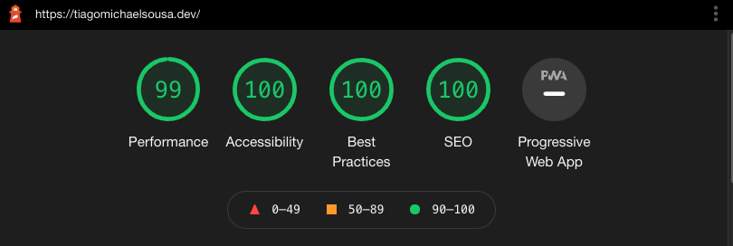

# Introduction

I love coding and I've been trying to create my website, during my free time, since a long time ago.
Until now, I never reached out to anyone that understands UI/UX which caused all my attempts of trying to create and build my website to be a complete failure. Yeah, I admit, a complete failure!
I wasn't enjoying the final results of the explorations that I made and started to not feeling motivated to build it anymore... so I made the decision! I asked for help from someone that understands about the topic!
This article is not the kind of article that you read when you already started to build your personal website and when you already have your hands dirty.
It's the kind of article that **you read before getting your hands dirty**, if you want to have some personal opinions and read about the experience of someone else, of course!
With that said, during this article, expect to see more of the `why` and not `how`. Based on feedback, I may write about specific topics in a more `get your hands dirty` and in a `step-by-step` model!

# Jamstack? Hell yes!

In 2015 static websites started to became very popular mainly because of the emergence of some tools like [Jekyll](https://jekyllrb.com/) that allows the transformation of plain text into static websites.
This concept of transforming plain text into static websites started to be explored and empowered by other engineers and the `Jamstack` came to life.
At the beginning of 2018, products like [Netlify](https://www.netlify.com/), [Gatsby](https://www.gatsbyjs.com/) and others helped a lot to promote this concept and during that year was the first time that a Jamstack conference took place.
Nowadays, the Jamstack concept continues to expand and evolve, becoming more mature, increasing the number of developers that adopted it, including me.

import { Box, Paragraph } from '@components';

<Box
  css={{
    my: '$32',
    display: 'grid',
    gridTemplateColumns: 'repeat(3, 1fr)',
    gridAutoRows: '1fr',
    gridGap: '$8',
    '& > :first-child': {
      gridColumn: '1 / -1',
    },
  }}
>
  <Box css={{ bc: '$primary', btlr: '$4', btrr: '$4', py: '$16' }}>
    <Paragraph align="center">JAM</Paragraph>
  </Box>
  <Box css={{ bc: '$secondary', bblr: '$4', py: '$16' }}>
    <Paragraph align="center">Javascript</Paragraph>
  </Box>
  <Box css={{ bc: '$secondary', py: '$16' }}>
    <Paragraph align="center">APIs</Paragraph>
  </Box>
  <Box css={{ bc: '$secondary', bbrr: '$4', py: '$16' }}>
    <Paragraph align="center">Markup</Paragraph>
  </Box>
</Box>

But, what does actually mean **Jamstack**? Well, as you saw above, JAM stands for Javascript, API & Markup and it's considered a modern way to architecture and develop applications based on client-side javascript, reusable APIs and prebuilt markup.
**T**here are a lot of benefits of using Jamstack within your next web application development:

- **Performance:** Serve pre-built markup and assets over a CDN.
- **Secure:** No need to worry about server or database vulnerabilities.
- **Less expensive:** Hosting of static files is very cheap or even free [like what I currently use](https://www.netlify.com/).
- **Awesome DX:** Developers aren't coupled to a monolithic architecture which means a quicker and more focused development experience.
- **Scalability:** If your product get more and more users, the CDN will seamlessly compensate.

I built and developed my website, which you are currently seeing, with [Gatsby](https://www.gatsbyjs.com) and this decision was based on **three main reasons**.

The **first reason** was the fact that I already had the opportunity to work with Gatsby in the past since I developed a couple of websites with it. At the time, I enjoyed the experience and felt productive while using the framework because I was able to deliver very quickly.
I think this framework is very well designed, provides an awesome developer experience and, most important, it has an awesome community that provides and develop a lot of plugins.
The number of individual contributors for Gatsby ecosystem is huge! With so many plugins and contributions from those developers, it becomes so easy and enjoyable to build something amazing!

**The second reason** was the out-of-the-box support for GraphQL and the integration with MDX.
One thing I was sure, I wanted to be able to write my blogposts in my code editor with markdown (like every software engineer loves to write documentation) and Gatsby made it really easy
(feel free to have a look into the [code base](https://github.com/tiagomichaelsousa/website) 👀).

**Lastly**, I wanted to ship the website and iterate over it. Do you know the feeling that you get when you actually contribute to Open Source or give back to the community?
I love that feeling and I was missing it for a long time. If I had chosen something else to develop my website I would have spent more time trying to understand the ecosystem of
the framework than being focused on the main task, which was the actual development of t**h**e website. I hope that you guys aren't misunderstanding me, I'm not saying that I don't like to "spend" time learning new things, I just had to make choices.
I wanted to try new tools and other things, as you guys will see below (spoiler alert) and I needed to feel some balance between productivity and the time that I was spending learning things.
I know that I'm not the only one with the same opinion 🙂

import { Flex } from '@components';

<Flex justify="center" align="center">
  <blockquote class="twitter-tweet">
    <p lang="en" dir="ltr">
      Done is better than perfect. Because perfect never gets done. 🚀 Ship early, get feedback, iterate! 💪🏼
    </p>
    &mdash; Felipe Schmitt (@schmittfelipe)
    <a href="https://twitter.com/schmittfelipe/status/1479041555000446976?ref_src=twsrc%5Etfw">January 6, 2022</a>
  </blockquote>
</Flex>

To close up this chapter, before being sure that I wanted to go with Gatsby I also had a look into [Gridsome](https://gridsome.org) since I love [Vue](https://vuejs.org). [NextJs](https://nextjs.org) was also an option.

# What about UI and theming?

##### Please reach out to someone that knows what they are doing!

Did you guys ever try to develop a website without any help from someone expert in User Interface and User Experience? Well, at least I tried... and not just once! It was kind of a waste of time!

When the idea to develop my personal website crossed my mind, I w**a**nted to create something very personal, something that would identify my self (that's why you guys see so many memojis, I wanted to use them because I think they are really funny and personal)
but before having the Figma mocks for the UI that you guys are seeing right now, I probably created five different versions of my website and didn't enjoyed any.
Since I wanted to create something very unique and wasn't enjoying the final result, I wasn't feeling motivated anymore and started to give up on the idea but...
I did it! I decided to talk with someone that understands about UI/UX and the final result was this one, which I love.

Huge shout out to **Mauricio Oliveira** a**n**d the amazing work that he did, which made it possible for me to write this article today. For that I will be forever grateful 🙏

##### Design system

At the beginning of this article, I said that I wanted to use Gatsby to feel productive regarding the development of features for the website but this decision was also made in order to create a
balance between productivity and learning new things. As part of the "learning new things", I wanted to try [Stitches](https://stitches.dev) because, at the time, while I was scrolling in my Twitter feed,
I remember that I saw so many software engineers giving their feedback regarding stitches and saying how great it was that I felt that I needed to give it a try. And guess what? Best decision ever, what a great tool!
With all the features that stitches has, it was really simple to style the components and give them the flexibility that I wanted, even to be used in the blog post pages.

Creating different themes was really simple! It's just a matter of extending the default theme and overwriting some values as you can see [here](https://github.com/tiagomichaelsousa/website/blob/main/src/theme/stitches.config.ts).
From sizes to colors, you can overwrite everything for a specific theme as you can see below:

```js showLineNumbers
// Default theme

export const { createTheme } = createStitches({
  theme: {
    colors: {
      text: '#000000',
      contrast: '#000000',
      paper: '#ffffff',
      gray: '#757575',
      darkGray: '#454545',
      white: '#ffffff',
      black: '#000000',
    },
  },
});
```

```js showLineNumbers
// Custom/Dark theme

export const darkTheme = createTheme('dark-theme', {
  colors: {
    text: '#ffffff',
    paper: '#040620',
  },
});
```

The example above is a simple one, where you just change the bac**k**ground color and the text color based on the selected theme. If this was so simple, imagine how many themes you can create and how flexible it is when you think about the way that you build and code your components 🚀

Besides the hype that I was feeling about [Stitches](), it wasn't the only option on the table of course!
[Bootstrap](https://getbootstrap.com/) was the first CSS tool that I ever used because, you know ... If you are a frontend engineer I'm pretty sure that you already used Bootstrap once in your life!
But after using Bootstrap, the second CSS tool/library that I used was [Tailwind](https://tailwindcss.com/) because at the time I was learning Laravel and it was shipped as an option so I decided to give it a try.
I really enjoyed the experience and Tailwind grew a lot since there! I think Tailwind is also a reall**y** nice option when we talk about choosing a tool to create your design system, so it was the other option that I had on the table.

These two tools are really nice and I can't say "I prefer this one over this one". If you choose one of them, I do believe that you will love the experience and the outcome **o**f your product!

## Code blocks

One thing that wanted for sure was fancy code blocks for my blog post pages with code highlights, s**u**pport for multiple languages, themes, line numbers...
you guys know, everything that we are already used to see in technical blogs but I didn't knew how to do it.

One of my inspirations and where I learned a lot was from [Pedro Duarte](https://twitter.com/peduarte) blog posts regarding this topic.
If you guys are curious, **f**eel free to have a look [here](https://ped.ro/writing/code-blocks-but-better).

Currently, when I write my blog posts and I need code blocks I'm able to:

- change the theme c**o**lors;

```jsx theme=yellow
// do you want a yellow theme?

import { Box, Paragraph } from '@components';

<Box css={{ bc: '$primary', btlr: '$4', btrr: '$4', py: '$16' }}>
  <Paragraph align="center">JAM</Paragraph>
</Box>;
```

```jsx theme=pink
// or a pink theme?

import { Box, Paragraph } from '@components';

<Box css={{ bc: '$primary', btlr: '$4', btrr: '$4', py: '$16' }}>
  <Paragraph align="center">JAM</Paragraph>
</Box>;
```

```jsx
// well, you always have a default one, right?

import { Box, Paragraph } from '@components';

<Box css={{ bc: '$primary', btlr: '$4', btrr: '$4', py: '$16' }}>
  <Paragraph align="center">JAM</Paragraph>
</Box>;
```

- have support fo**r** multiple languages (but this comes out of the box with markdown files);

```php
/**
 * Execute the console command.
 *
 * @return mixed
 */
public function handle()
{
    $dd = $this->confirm('Do you also love laravel? 👀', true);
}
```

- highlight a specific line;

```jsx line=4
import { Box, Paragraph } from '@components';

<Box css={{ bc: '$primary', btlr: '$4', btrr: '$4', py: '$16' }}>
  <Paragraph align="center">JAM</Paragraph>
</Box>;
```

- highlight a range of lines

```jsx line=3-5
import { Box, Paragraph } from '@components';

<Box css={{ bc: '$primary', btlr: '$4', btrr: '$4', py: '$16' }}>
  <Paragraph align="center">JAM</Paragraph>
</Box>;
```

- highlight multiple lines

```jsx line=1,4
import { Box, Paragraph } from '@components';

<Box css={{ bc: '$primary', btlr: '$4', btrr: '$4', py: '$16' }}>
  <Paragraph align="center">JAM</Paragraph>
</Box>;
```

- highlight a single word

```jsx
import { Box, Paragraph } from '@components';

<Box css={{ bc: '$primary', btlr: '$4', btrr: '$4', py: '$16' }}>
  <__Paragraph__ align="center">JAM</Paragraph>
</Box>;
```

- use the diff syntax that we are used to in GitHub

```diff
return [
-       'paths' => ['api/*', 'sanctum/csrf-cookie'],
+       'paths' => ['api/*', 'graphql', 'sanctum/csrf-cookie'],
];
```

- enable and disable line numbers

```jsx showLineNumbers
import { Box, Paragraph } from '@components';

<Box css={{ bc: '$primary', btlr: '$4', btrr: '$4', py: '$16' }}>
  <Paragraph align="center">JAM</Paragraph>
</Box>;
```

There are a lot of reall**y** cool things that you can do with these features and I may write an article regarding this in the future 🙂

# Articles

The main purpose of my website was t**o** start writing things and share with you what I've been learning, because yo**u** know... sharing is caring!
Also, I wanted to put the code base of my website public in [GitHub](https://github.com/tiagomichaelsousa/website) for two main reasons.
The **first one** is to allow everyone that wants to have a look and, who knows, maybe take a couple of ideas from it, to feel free to do.
**Secondly**, a colleague of mine, which I appreciate a lot, loves quoting Linus Torvalds by saying "Talk is cheap. Show me the code." so there it is, some code 🚀
A huge shout out to him as well, [Luis Oliveira](https://twitter.com/_luisFilipePT).

Besides [twitter](https://twitter.com/tmichaelsousa), articles are a way that I can sha**r**e with you some content and I take a lot of pleasure while writing things about something that I like.
That's the main reason why you are probably reading this blog post.

I already wrote articles in [medium](https://medium.com/@tiagomichaelsousa) and the experience of writing things there was great but what I really wanted was to write things as every software engineer loves... with markdown!
And you know why every software engineer likes to write things in markdown? Because, in general, we don't like to write, unless it looks like actual code 😉
Writing blog posts in markdown with the IDE that you use every day, with your configuration and having the possibility to commit the changes to a repository gives you a totally different experience from writing in blog platforms.

Nowadays, when I want to write an article, I just open my editor, create a `.mdx` file and start to write what I want! I don't even run the website locally to see how it looks like
because everything is configured with stitches and rehype to look amazing.
[In this file](https://github.com/tiagomichaelsousa/website/blob/main/src/components/MdxComponents/MdxComponents.tsx) you can see how I convert the components from `mdx` to my custom components and apply my theme styles.

All the blog post pages are being created in build time with the `createPages` feature from Gatsby. If you want to have a closer look at how I did it, feel free to click [here](https://github.com/tiagomichaelsousa/website/blob/main/gatsby-node.js).
I could also create a `step-by-step` article about this but this topic is really well documented in [Gatsby website](https://www.gatsbyjs.com/docs/creating-and-modifying-pages/).

## SEO, Analytics, Lighthouse results? I want them all

These three topics were things that I also wanted to explore a little bit further while developing my website and was pretty easy to develop these features with Gatsby because there is a plugin for every single thing.
Talking about plugins, you can have a look into what I use in my [gatsby-config](https://github.com/tiagomichaelsousa/website/blob/main/gatsby-config.js) file.

##### Search Engine Optimization

Regarding SEO, I used [gatsby-plugin-robots-txt](https://www.gatsbyjs.com/plugins/gatsby-plugin-robots-txt) in order to create the `robos.txt`. This file will be created when you run the build of the website in production mode.
If you never heard about the `robots.txt` and for what it's used it's simple. I'ts basically a text file with instructions for search engine crawlers.
By having this file within the root directory of your domain, you can easily include and exclude entire domains, complete directories, one or more subdirectories or individual files from search engine crawling.
If you are curious, you can have a look at mine [here](https://tiagomichaelsousa.dev/robots.txt) which is pointing to the [sitemap](https://tiagomichaelsousa.dev/sitemap/sitemap-0.xml).

Still regarding SEO, I also configured the `<meta/>` tags for each page of the website. If you share the URL for my website on your social media, you will also see a fancy image of my memoji saying hello!
But this image doesn't make sense for the blog posts pages, right?
Rather than showing the image of my memoji saying hello maybe it makes more sense to show a different image with the title of the article and the name of the author, don't you think?
And here we go again, trying to find a solution for a problem! How can we generate a thumbnail for every blog post automatically?
Because I really don't want to spend time creating an image for every single article that I will write, I want to automate that!
Did you ever heard about [Cloudinary](https://cloudinary.com)? I bet you did! If you don't, you will certainally hear it now.
[Cloudinary](https://cloudinary.com/) allows you to manipulate, transform and also optimize images at the same time!
It has a generous free plan that you can use in order **t**o try it or even use it in your personal website 😉

I created an image with the background that I wanted and then I use their API in order to add title some text over the image!
They also have [SDKs](https://cloudinary.com/documentation/cloudinary_sdks) for a couple of languages, including javascript, but I didn't had the need to explore/use more features so I only used their API.

You can easily find the URL for the background that I'm using if you dig into the code base but I will save you some time and show it to you.

```
https://res.cloudinary.com/tiagomichaelsousa/image/upload/v1/articles/seo-article_pw6fpl.png
```

As I said, I wanted to automatically put the text title above the image. For that, I just needed to find the correct `x` and `y` axis to put the t**i**tle of the article and update the `<meta />` tags for that blogpost.
Since we have access to the value of title in the [article component](https://github.com/tiagomichaelsousa/website/blob/main/src/templates/article.tsx) we can easily use it to create the thumbnail automatically like
[this one](https://res.cloudinary.com/tiagomichaelsousa/image/upload/co_white,l_text:Montserrat_20:Check%20out%20this%20article,x_-45,y_-60/c_fit,co_white,l_text:Montserrat_40_bold:Did%20you%20actually%20open%20this%20link%3F%0D%0AI%20love%20your%20commitment!,w_650,x_120,y_10/v1/articles/seo-article_pw6fpl.png).

##### Analytics

Regarding analytics, there is no big news or science... I used [Google Analytics](https://marketingplatform.google.com/about/analytics/) like **m**ost of every website uses. I just wanted to know a couple of things like from where are you guys reading the content
that I write, from which devices (in other to improve the UI) and which blog posts are getting more attraction in order to understand what you guys enjoy to read.

The implementation of Google Analytics is pretty simple and straightforward! You just need to create a new account and get a `trackingId`. After this you can use a plugin for the framework that you are using or even add the `<script />` code as Google suggests.

##### Lighthouse

I bet that you already heard about Lighthouse! Lighthouse is an open-source tool that allows you to get metrics regarding the quality of your website!
It creates reports regarding performance, accessibility, progressive web apps, SEO and other features!
You don't need to install anything as it comes with Chrome! You can run it by accessing your Dev Tools (`⌘` + `⌥` + `i` for MacOs), open Lighthouse tab and click Generate R**e**port with the Categories and Device type of your choice!

I will take the opportunity to show you one of the reports that i was able to generate while I was improving my Lighthouse scores.



The website has pretty nice scores because most of the things are being done with SSR and in build time!
FYI, configuring Stitches with Server-Side Rendering is really easy, please have a look at how to enable it [here](https://stitches.dev/docs/server-side-rendering)

## What about domains and hosting?

##### Choosing my domain

Do you know the feeling of naming components and variables? Well, even for the domain of my website I had that problem!
The main problem was more the TLD (Top Level Domain) than the hostname itself! I didn't know what to choose between `.dev`, `.me`, `.tech` or `.space` but I did know that
`tiagomichaelsousa` would be the hostname mainly because I've this name for basically most of my dev related topics. Noticed that I just mentioned `dev` things? That's the reason why I choosed the `.dev` for the TLD.

I tried to buy the domain from Google but, unfortunately, it's not possible to buy `.dev` domains from Google in Portugal, so I had to reach out to another provider.

##### Hosting

I already spoiled at the beginning of the article but Netlify was my choice regarding hosting! It has a generous free plan, enough for my personal website, and great integrations with
GitHub. I just needed to configure it with a few steps in Netlify dashboard and that was it! On merge to master it deploys the website! Another thing that's really nice it's the Pull Request Preview.
When you create a new PR it will deploy that version in a temporary URL so that you can see the changes!

Aligned with these features, adding my custom domain was just a matter of updating my nameservers in the domain name service provider! 5 minutes and the job was done 🔥

Still regarding this topic, I also put all the network traffic passing through [Cloudflare](https://www.cloudflare.com/) services which offer nice features and again, a generous free plan 🚀

## Conclusions

I hope this very opinionated article will help you somehow if you are starting to build your personal website!
This was just the experience that a guy that who loves coding had while trying to achieve one of his milestones. I'm currently sharing this experience because it may save you time in the future!
Since I'm talking about milestones, one last tip that helps me a lot, **be objective-driven**! It will keep you motivated every time that you achieve something!

If you found this article interesting, feel free to share it with your colleagues or friends, because you know... Sharing
is caring!

Also, if you enjoy working at a large scale in projects with global impact and if you enjoy a challenge, please reach
out to us at [xgeeks](https://xgeeks.io/)! We're always looking for talented people to join our team 🙌
