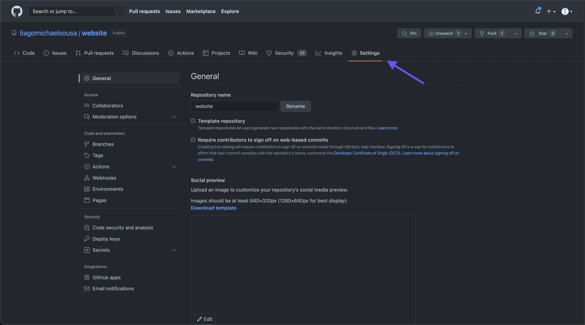
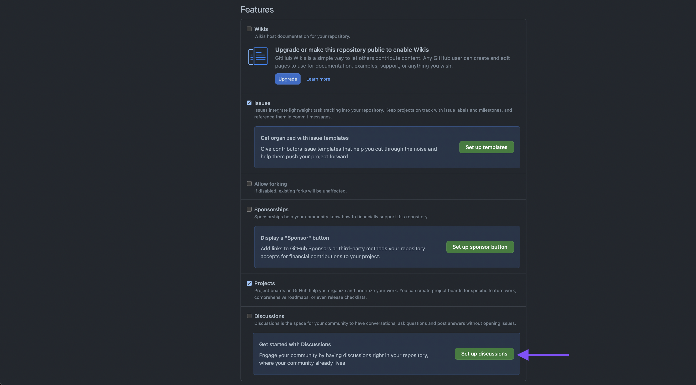
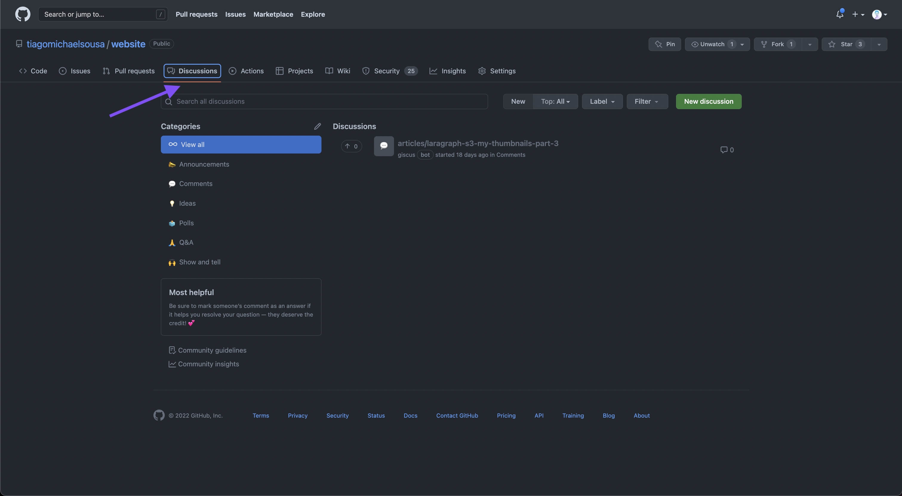
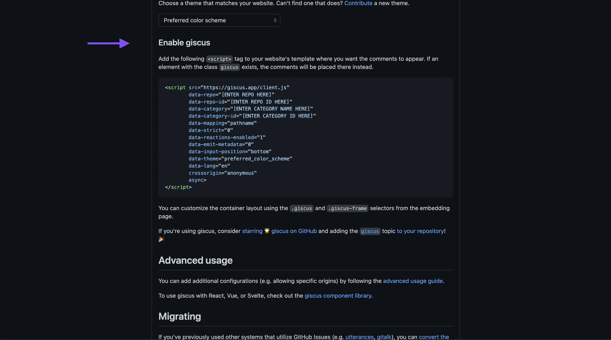

# Introduction

**Disclaimer:** If took time to read this blog post and you have a GitHub account please react to this article 😊🙏

Whenever I have some time I like to improve my personal projects and enrich them as I can. This time the topic is my website.

I was going through my website and something crossed my mind right away! What if I added comments and reactions to my blog posts? 🤔
I mean, comments aren't something that people often write in technical blog posts, unless they are really engaged with the author's content, and that's why I really like the reaction approach.
With reactions and emojis you can express yourself regarding something very particular and this something can be a comment, a blog post, a photo ... well, an unlimited list of options could be inserted here.

After understanding that I wanted to implement this for my personal website, even if it doesn't have many views, I started to investigate some solutions that were available
and, of course, as any Software Engineer I wanted to develop my own SaaS and provide an awesome development experience to whoever wanted to add comments or reactions to something but it would take
time to be developed and time to maintain. Developing this SaaS is one of my objectives as a Software Engineer but it's a huge commitment that I dont want to take at this point in my life.
**But who knows in the future 👀**

# Please, have a look 👀
Yes, Tiago... Now that you already talked about your 1 million dollar idea what about the result of the research that you did? Ouh yes.... sorry, I got distracted 👀
After my investigation I found a couple of **really cool** tools that I will list below as they can be a solution for you too:
  - [lyket](https://lyket.dev)
  - [disqus](https://disqus.com)
  - [commento](https://commento.io)
  - [react-facebook](https://www.npmjs.com/package/react-facebook)
  - [fastcomments](https://fastcomments.com)
  - [staticman](https://staticman.net)
  - [talkyard](https://www.talkyard.io)
  - [gitalk](https://gitalk.github.io)

... and last but not least:
  - [utteranc](https://utteranc.es)

Some of these tools are Software As A Service and others are open-source projects. 

To be very honest with you, I don't mind paying for a SaaS but it has to fulfill and cover my needs and none of the available options was a suitable solution 
for me. Since I wanted to implement this as soon as possible I focused a little bit more on the open source community and [utteranc](https://utteranc.es) looked very simple and promising
but I dug even deeper and found [giscus](https://giscus.app/) which was exactly what I was looking for!

Giscus is very inspired in [utteranc](https://utteranc.es) but besides the fact that it allows you to install but including a `<script />` tag it also has a nice
wrapper for multiple frameworks like [react](https://github.com/giscus/giscus-component/tree/main/react), [vue](https://github.com/giscus/giscus-component/tree/main/vue) 
and [svelte](https://github.com/giscus/giscus-component/tree/main/svelte) that you can install through `npm` or `yarn`.

But how [utteranc](https://utteranc.es) and [giscus](https://giscus.app/) save the data regarding the comments and reactions? The answer to that question was one of the reasons of why 
I chose this approach! They save the data directly in a GitHub repository, through the [GitHub Discussions](https://docs.github.com/en/discussions).
Wait, you are saying that for my SSG website I can have all the reactions and comments for my articles saved on GitHub? What a dream 🤩

# KISS 😘
Yes, KISS, Keep It Simple Stupid!

As my website is mostly viewed by technical people within the IT sector I thought that signing in with GitHub would be really nice as everyone has a GitHub account!
No need to get redirected to other services that you don't know or trust or even social media platforms! Keeping things within GitHub ecosystem looked like a good option.

But how can I do the same and implement it for my website? Well, I will try to make this step-by-step and as clean as possible!

## GitHub Configuration
First of all, you need to have a **public** GitHub repository, which in my case wasn't a problem as my website is open source and everyone can see the [codebase](https://github.com/tiagomichaelsousa/website).
After having a public repository you need to enable [GitHub Discussions](https://docs.github.com/en/discussions) in the repository settings under the **Features** section.





After enabling the GitHub Discussions you should be able to see a new tab called `Discussions` for your repository at the same level of the **Settings** like the image below:



Regarding GitHub configurations that's all! Now let's get to the code implementation

## What about code changes?

Code changes? You just need **3 minutes** and that's depending on the package manager that you are using 😅

First of all, let's start by installing the giscus package for the framework/library that you are using. In my case, I will install the react package.

```bash
yarn add @giscus/react
```

or

```bash
npm i @giscus/react
```

> if you are using *vue* or **svelte** just replace whatever is after **@giscus/** to the framework that you are using e.g. `yarn add @giscus/vue`

Now go to the `Configuration` section in [giscus](https://giscus.app/) and add your public repository name and choose the discussion category
for the comments and reactions. Of course, there are more configurations that you can change, feel free to choose whatever suits you best!

If you scroll a little bit you will find a section called **Enable giscus** that will contain all the props that you need to add to your component like the image below:



By the end of the configuration, you should have something very similar to this

```jsx filename=article.tsx
import Giscus from '@giscus/react';

<Giscus
  id="comments"
  repo={YOUR_REPO_NAME_HERE}
  repoId={YOUR_REPO_ID_HERE}
  category={YOUR_CATEGORY_HERE}
  categoryId={YOUR_CATEGORY_ID_HERE}
  mapping={YOUR_MAPPING_STRATEGY}
  reactionsEnabled="1"
  emitMetadata="0"
  inputPosition="top"
  theme={YOUR_PREFERED_THEME}
  lang="en"
  loading="lazy"
/>
```

Everything is extremely customizable as you can see on the [giscus website](https://giscus.app/). 
Feel free to spend time having a look and trying the multiple available options that the tool offers.

## But can you protect me a little bit?

As you can imagine, everyone can have access to the values that you use to integrate Giscus with your GitHub discussions by doing what you just did!
So what prevents me to add this to a random page and start spamming your discussions and populate them with random data?

For that, and that's why is very important to always read everything, you can add a `giscus.json` in your project root folder specifying the **origins** or even **originsRegex** 
like I have [here](https://github.com/tiagomichaelsousa/website/blob/main/giscus.json).

This information is available in the giscus [ADVANCED-USAGE.md](https://github.com/giscus/giscus/blob/main/ADVANCED-USAGE.md#giscusjson) documentation.

# Conclusions

You are still here? Did you read this section?** Damn!** If you, react with a 🙈 to the article!

Finally, I will just [add here](https://github.com/tiagomichaelsousa/website/pull/26) a link to the PR where I made these changes. 
Feel free to read the **Special notes for your reviewer** in the PR description and you will understand how easy was to integrate giscus!

Anyways I hope you found this article interesting, feel free to share it with your colleagues or friends, because you know... Sharing
is caring!

Also, if you enjoy working at a large scale in projects with global impact and if you enjoy a challenge, please reach
out to us at [xgeeks](https://xgeeks.io/)! We're always looking for talented people to join our team 🙌
