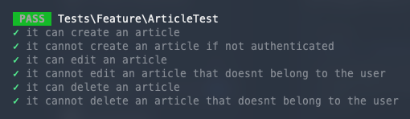

# Introduction

Laragraph is a really simple project that I created just to have the opportunity to explore a couple of tools that I was curious about and which I wanted to give it a try.

There are 3 certainties in life: death, taxes and the fact that you create a blog post application every time that you want to try a new framework/tool 😂

Based on one of these 3 certainties in life, in this part 2 of building Laragraph we will handle a lot of topics like **Migrations**, **Seeds**, **Factories**, **Policies**, **Validation** and of course, **Testing**.
I will keep the same structure as the previous article, a step-by-step with code examples that you can copy and test for yourself.

# Articles? But I want them all So I get them all

In order to have articles, we need to create a couple of resources before, like the [Model](https://laravel.com/docs/9.x/eloquent#generating-model-classes),
the [Migration](https://laravel.com/docs/9.x/migrations#main-content), the [Factory](https://laravel.com/docs/9.x/database-testing#defining-model-factories) and, since we are working with GraphQL, we will need a [Mutation](https://lighthouse-php.com/5/api-reference/commands.html#mutation).

We can take leverage of artisan to create these resources like below:

```
sail artisan make:model Article -mf
```

By running this command, laravel will create the Article model, migration and factory for you! It's all about development experience 🚀
The first thing that we will do is to update the schema for the articles table and define the foreign key for the `user_id`. The migration file should be under the `database/migrations/` folder.

```php showLineNumbers
Schema::create('articles', function (Blueprint $table) {
    $table->id();
    $table->string('slug')->unique();
    $table->string('title');
    $table->text('body');
    $table->timestamps();

    $table->foreignIdFor(User::class)
        ->constrained()
        ->cascadeOnDelete()
        ->cascadeOnUpdate();
});
```

After configuring the migration for the articles, let's add the fillable columns and define the Eloquent Relationship for the article model under our `app/Models/Article.php` file.

```php showLineNumbers
protected $fillable = ['title', 'body', 'slug'];

public function user(): BelongsTo
{
    return $this->belongsTo(User::class);
}
```

We also need to define the inverse Eloquent Relationship for the `User`. Since an article `belongsTo` a user, a user `hasMany` articles. So let's update our `app/Models/User.php` file:

```php showLineNumbers
public function articles(): HasMany
{
    return $this->hasMany(Article::class);
}
```

Now it's time to update our factory and our seeds so that every time that we want to refresh our database we have a clean environment and data.
In your `ArticleFactory.php` update the `definition()` method and add the following keys to the return statement:

```php showLineNumbers
public function definition()
{
    return [
        'user_id' => User::factory(),
        'title' => $this->faker->sentence(),
        'slug' => $this->faker->slug(),
        'body' => $this->faker->paragraphs(6, true),
    ];
}
```

Finally, and before running our migrations and our seeds, the only missing step is to update our database seeder file.
When you are working on big projects, it makes sense to split the seeds by domain under the `database/seeders` folder and call those seeds in the `DatabaseSeeder.php` file but since this will be a small project we will
call the factories directly from the `DatabaseSeeder` file like below:

```php showLineNumbers
public function run()
{
    $user = User::factory()->create(['email' => 'foo@bar.baz']);

    Article::factory(5)->for($user)->create();
}
```

This piece of code above will ensure that every time that we run our seeds we will have access to a user with the email `foo@bar.baz` that has already written 5 articles 😎 What a writer! 👀

After all those changes, let's ensure that everything is working! For that, let's run our migration command and include the seeds:

```
sail artisan migrate:refresh --seed
```

And BOOOM 💣 1 user and 5 articles in our database 🔥 Let's handle some GraphQL now!

To have a more clear overview of the project, I separated the schemas by domain. Since Lighthouse will only look for one schema file (which is `schema.graphql`), let's create a `articles.graphql` file at the same level as the `schema.graphql`
and include this new schema file in our main schema.

In the `graphql/schema.graphql` add the following line and EOF:

```graphql
#import articles.graphql
```

and now let's define our Article `Type`, `Mutation` and `Query` at `graphql/articles.graphql`

```graphql
type Article {
  "Unique primary key."
  id: ID!

  "Unique slug address."
  slug: String!

  "Non-unique title."
  title: String!

  "Non-unique body."
  body: String!

  "The author of the article"
  user: User! @belongsTo

  "When the article was created."
  created_at: DateTime!

  "When the article was last updated."
  updated_at: DateTime!
}

extend type Query {
  "List multiple articles."
  articles("Filters by name. Accepts SQL LIKE wildcards `%` and `_`." name: String @where(operator: "like")): [Article!]!
    @paginate(defaultCount: 10)
}
```

Since we already have a user that has written 5 articles in the database and we added a query to return those articles, why not just give it a try?
Go to your GraphQL playground at `http://localhost/graphql-playground` and write the following query:

```graphql
{
  articles {
    data {
      slug
      title
      body
      user {
        name
        email
      }
    }
    paginatorInfo {
      currentPage
      firstItem
      total
    }
  }
}
```

Ouh! Wait, we can access the user data if we want? 😱 But how?
Well, when we created your Article `Type` we added a field called `user` with a `@belongsTo` directive that will return a `User`. This directive comes out of the box from Lighthouse and takes leverage from
the Eloquent Relationship that you previously defined for the Article Model! Now with the power of GraphQL, we can decide which data we want to fetch and if you want to paginate them, of course 😎

# Let me write!

Now that we can fetch the articles and respective authors, we need to allow them to create some content but there are a couple of things that we need to ensure:

- a user needs to be authenticated to create a new article
- the slug for each blog post should be unique

As we already saw, GraphQL uses `Queries` and `Mutations` to perform operations and handle data flow. To allow our writers to share some content, we need to create a new Mutation: `ArticleMutation`.
For that, let's use our lighthouse artisan command:

```
sail artisan lighthouse:mutation ArticleMutation
```

This command will create an `ArticleMutation.php` under `app/GraphQL/Mutations` so that we can add our logic. I like to see the Mutations as if they were controllers, so let's create a `store` method to create a new article.

```php showLineNumbers
public function store($_, array $request)
{
    return request()->user()->articles()->create($request);
}
```

Do you see something wrong with the method above? Yeah, it creates the article but it doesn't verify if the user is authenticated and doesn't validate the data that is being stored in the database.
That's because Lighthouse handles these kinds of things with [directives](https://lighthouse-php.com/5/api-reference/directives.html) at the schema level.

To do so, let's add the `CreateArticleInput` Input and `createArticle` mutation to your `graphql/articles.graphql`:

```graphql showLineNumbers
input CreateArticleInput @validator {
  slug: String!
  title: String!
  body: String!
}

extend type Mutation {
  createArticle(input: CreateArticleInput @spread): Article! @guard @field(resolver: "App\\GraphQL\\Mutations\\ArticleMutation@store")
}
```

To solve the authentication problem we just need to add the `@guard` directive (which once again comes out of the box with Lighthouse) in the mutation. This directive will ensure that the user that is making the request is authenticated.
This solves authentication but it doesn't solve validation!

Could you imagine if we were able to use all the validation rules that laravel gives us out of the box with a GraphQL API? It would be pretty nice, right?
Well, it's possible! 🚀 You can use the [rules directly in the schema](https://lighthouse-php.com/5/security/validation.html#single-arguments)
but I prefer to have the validation logic separated from the schema with a custom class to handle the validation rules and logic.
That's exactly what the `@validator` directive does! With this directive, Lighthouse will search for a CreateArticleInputValidator under `app/GraphQL/Validators` folder.
Since we don't have one, let's check if we can create a validation class with Lighthouse artisan command... and guess what? yeah, we have a command for that 😎

```
sail artisan lighthouse:validator CreateArticleInputValidator
```

Within this file, you can use every single [validation rule](https://laravel.com/docs/9.x/validation#available-validation-rules) that laravel offers out of the box!
Let's add a couple of rules to validate our create article mutation!

```php showLineNumbers
public function rules(): array
{
    return [
        'slug' => ['required', Rule::unique('articles', 'slug')],
        'title' => ['required'],
        'body' => ['required'],
    ];
}
```

At this point, our users should be able to publish their articles! Let's try to create one ourselves? Let's use our GraphQL playground and run the following mutation:

```graphql
mutation {
  createArticle(input: { slug: "laragraph-articles-for-everyone", title: "title", body: "My awesome content 😎" }) {
    title
    slug
  }
}
```

> Don't forget to add the `Authorization` header with the `Bearer` token that you retrieve from the login mutation due to the `@guard`.

If we did everything right, we should have a new record in our database for the articles table! 🤗

# OOPS, I made a typo in the title!

It's nice to allow users to write their articles but what if they need to make changes? We need to support that feature!
The process should be very similar to the create article process:

- ensure authentication
- ensure that the user that is editing the article it's the owner
- validate the request

To allow users to edit their articles, let's start by updating our GraphQL schema for the articles and add the `Input` and the `Mutaton`:

```graphql showLineNumbers
input UpdateArticleInput @validator {
    id: ID!
    slug: String
    title: String
    body: String
}

extend type Mutation {
    ...
    updateArticle(input: UpdateArticleInput @spread): Article!
        @guard
        @can(ability: "update", model: "App\\Models\\Article", find: "id")
        @field(resolver: "App\\GraphQL\\Mutations\\ArticleMutation@update")
}
```

Did you notice something different from the `createArticle` mutation? Exactly, besides the `@guard` and `@field` directives, we also added a new one, the `@can` directive.
This directive comes, again, out of the box with Lighthouse and abstracts the logic to use Laravel default built-in [Policies](https://laravel.com/docs/9.x/authorization#creating-policies).
Policies are a way to validate if the user that is performing the action has permission to fulfill the operation. In our case, we need to ensure that the user that is updating the article is the person that actually wrote it!

Let's use Laravel built-in artisan command to create the policy for our article model:

```
sail artisan make:policy ArticlePolicy --model=Article
```

This command will create a new file at `app/Policies/ArticlePolicy.php` with a couple of methods pre-defined. For now, we just need to add logic to the `update` method as below:

```php showLineNumbers
public function update(User $user, Article $article): bool
{
    return $user->is($article->user);
}
```

By adding the return statement above, we are ensuring what we need! How clean hein? 🤩

Before updating the typo that we did in the title of the article, we need to create our `UpdateArticleInputValidator` class to validate the request!

```
sail artisan lighthouse:validator UpdateArticleInputValidator
```

and add some basic rules:

```php showLineNumbers
public function rules(): array
{
    return [
        'id' => ['required'],
        'slug' => ['sometimes', Rule::unique('articles', 'slug')->ignore($this->arg('id'), 'id')],
        'title' => ['sometimes'],
        'body' => ['sometimes'],
    ];
}
```

Even with everything that we did so far, this feature is still not ready! Can you guess what's missing? Exactly, adding the logic for our mutation!
Under our `app/GraphQL/Mutations/ArticleMutation.php` let's add the following for method:

```php showLineNumbers
public function update($_, array $request)
{
    $article =  Article::findOrFail($request['id']);

    $article->update($request);

    return $article;
}
```

At this point, we are able to go to our GraphQL playground and update the post that we created with the following mutation

```graphql
mutation {
  updateArticle(input: { id: 6, title: "#2 - Laragraph - Articles for Everyone" }) {
    slug
    title
    body
  }
}
```

And our record was updated successfully 😎

# Can I also delete it? Please 🙏

Deleting an article it's the last operation that we will allow our users to do under the article model!

- For our schema, let's add the following mutation under `graphql/articles.graphql`:

```graphql showLineNumbers
extend type Mutation {
    ...
    deleteArticle(id: ID!): Article!
        @guard
        @can(ability: "delete", model: "App\\Models\\Article", find: "id")
        @field(resolver: "App\\GraphQL\\Mutations\\ArticleMutation@destroy")
}
```

- Update our `ArticlePolicy`:

```php showLineNumbers
public function delete(User $user, Article $article): bool
{
    return $user->is($article->user);
}
```

- And add the logic to our mutation at `app/GraphQL/Mutations/ArticleMutation.php`:

```php showLineNumbers
public function destroy($_, array $args)
{
    $article = Article::findOrFail($args['id']);

    $article->delete();

    return $article;
}
```

And with these 3 changes we have the delete feature ready 😎 Let's run the mutation!

```graphql showLineNumbers
mutation {
  deleteArticle(id: 6) {
    title
  }
}
```

# Do I deserve some tests? 🥺

To be sure that our features are working as expected, let's write some [pest](https://pestphp.com/) tests as we did for the previous article, shall we? 🚀
Let's start by creating our test file with artisan:

```
sail artisan pest:test ArticleTest
```

- Can a user create an article? 🤔

```php showLineNumbers
it('can create an article', function () {
    Sanctum::actingAs(User::factory()->create());
    $article = Article::factory()->make();

    $this->assertDatabaseCount('articles', 0);

    $this->graphQL(
        /** @lang GraphQL */
        '
        mutation ($slug: String!, $title: String!, $body: String!) {
            createArticle(input: { slug: $slug, title: $title, body: $body }) {
                title
                slug
            }
        }',
        [
            'slug' => $article->slug,
            'title' => $article->title,
            'body' => $article->body,
        ]
    )->assertJson([
        'data' => [
            'createArticle' => [
                'title' => $article->title,
                'slug' => $article->slug,
            ],
        ],
    ]);

    $this->assertDatabaseHas('articles', [
        'title' => $article->title,
    ]);
});
```

- Can a user edit an article if he's not authenticated? 🤔

```php showLineNumbers
it('cannot create an article if not authenticated', function () {
    $article = Article::factory()->make();

    $this->assertDatabaseCount('articles', 0);

    $this->graphQL(
        /** @lang GraphQL */
        '
        mutation ($slug: String!, $title: String!, $body: String!) {
            createArticle(input: { slug: $slug, title: $title, body: $body }) {
                title
                slug
            }
        }',
        [
            'slug' => $article->slug,
            'title' => $article->title,
            'body' => $article->body,
        ]
    )->assertGraphQLErrorMessage('Unauthenticated.');

    $this->assertDatabaseCount('articles', 0);
});
```

- Can a user edit an article? 🤔

```php showLineNumbers
it('can edit an article', function () {
    Sanctum::actingAs($user = User::factory()->create());
    $existentArticle = Article::factory()->for($user)->create();
    $newArticle = Article::factory()->make();

    $this->assertModelExists($existentArticle);

    $this->graphQL(
        /** @lang GraphQL */
        '
        mutation ($id: ID!, $title: String!) {
            updateArticle(input: { id: $id, title: $title }) {
                title
                slug
            }
        }',
        [
            'id' => $existentArticle->id,
            'title' => $newArticle->title,
        ]
    )->assertJson([
        'data' => [
            'updateArticle' => [
                'title' => $newArticle->title,
                'slug' => $existentArticle->slug,
            ],
        ],
    ]);

    $this->assertDatabaseCount('articles', 1);
    $this->assertDatabaseHas('articles', [
        'title' => $newArticle->title,
    ]);
});
```

- Can a user edit an article that he didn't create? 🤔

```php showLineNumbers
it('cannot edit an article that doesnt belong to the user', function () {
    Sanctum::actingAs(User::factory()->create());
    $existentArticle = Article::factory()->create();
    $newArticle = Article::factory()->make();

    $this->assertModelExists($existentArticle);

    $this->graphQL(
        /** @lang GraphQL */
        '
        mutation ($id: ID!, $title: String!) {
            updateArticle(input: { id: $id, title: $title }) {
                title
                slug
            }
        }',
        [
            'id' => $existentArticle->id,
            'title' => $newArticle->title,
        ]
    )->assertGraphQLErrorMessage('This action is unauthorized.');
});
```

- Can a user delete an article? 🤔

```php showLineNumbers
it('can delete an article', function () {
    Sanctum::actingAs($user = User::factory()->create());
    $article = Article::factory()->for($user)->create();

    $this->assertModelExists($article);

    $this->graphQL(
        /** @lang GraphQL */
        '
        mutation ($id: ID!) {
            deleteArticle(id: $id) {
                title
            }
        }
    ',
        ['id' => $article->id]
    )->assertJson([
        'data' => [
            'deleteArticle' => [
                'title' => $article->title,
            ],
        ],
    ]);

    $this->assertModelMissing($article);
});
```

- Can a user delete an article that he didn't create? 🤔

```php showLineNumbers
it('cannot delete an article that doesnt belong to the user', function () {
    Sanctum::actingAs(User::factory()->create());
    $article = Article::factory()->create();

    $this->assertModelExists($article);

    $this->graphQL(
        /** @lang GraphQL */
        '
        mutation ($id: ID!) {
            deleteArticle(id: $id) {
                title
            }
        }
    ',
        ['id' => $article->id]
    )->assertGraphQLErrorMessage('This action is unauthorized.');

    $this->assertModelExists($article);
});
```

After writing all these tests let's run them and see the output!

```
sail artisan test
```



## Conclusions

This was the **second part** of a series that I will be writing while I explore these tools.
I hope that this article can help someone in the future that is trying to develop a GraphQL API with Laravel!

For each article I will attach a PR so you can view all the changes! For this one, feel free to check it [here](https://github.com/tiagomichaelsousa/laragraph/pull/2).

I may release the third part regarding file uploads, what do you think?! Feel free to drop me some feedback on [twitter](https://twitter.com/tmichaelsousa)! 🙏

If you found this article interesting, feel free to share it with your colleagues or friends, because you know... Sharing
is caring!

Also, if you enjoy working at a large scale in projects with global impact and if you enjoy a challenge, please reach
out to us at [xgeeks](https://xgeeks.io/)! We're always looking for talented people to join our team 🙌
