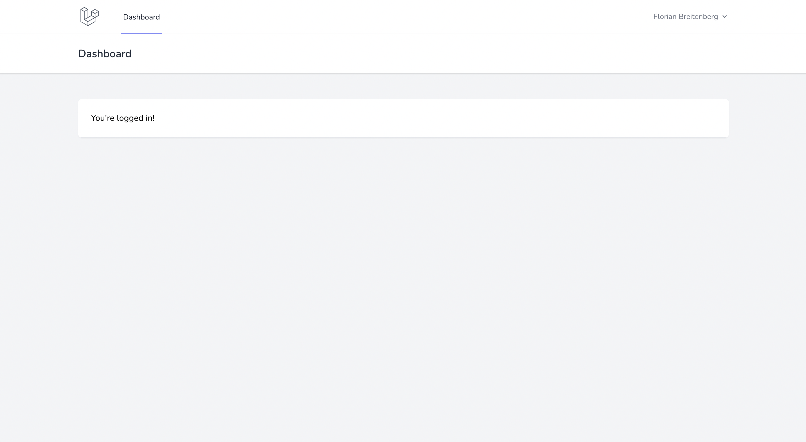
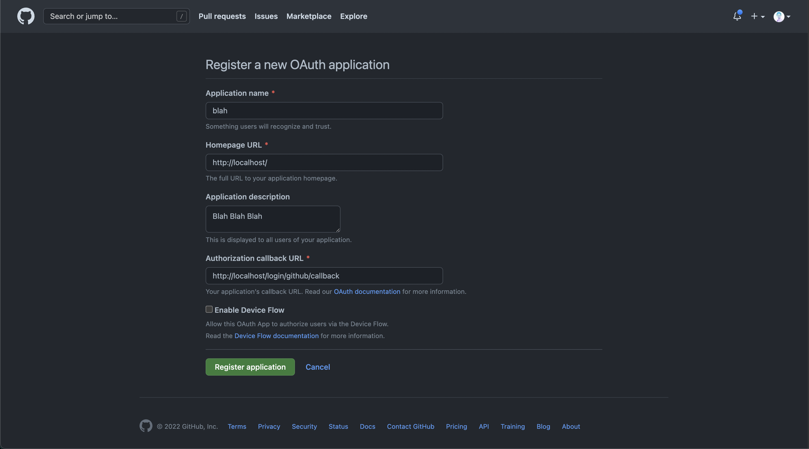
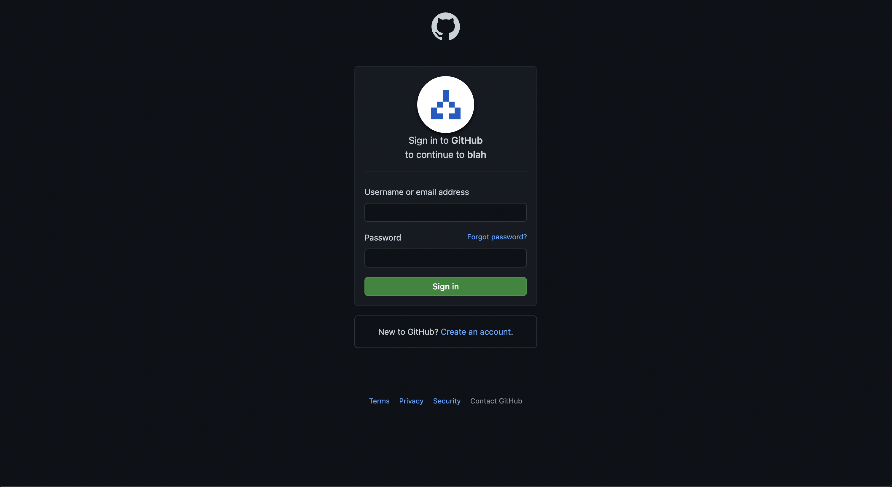
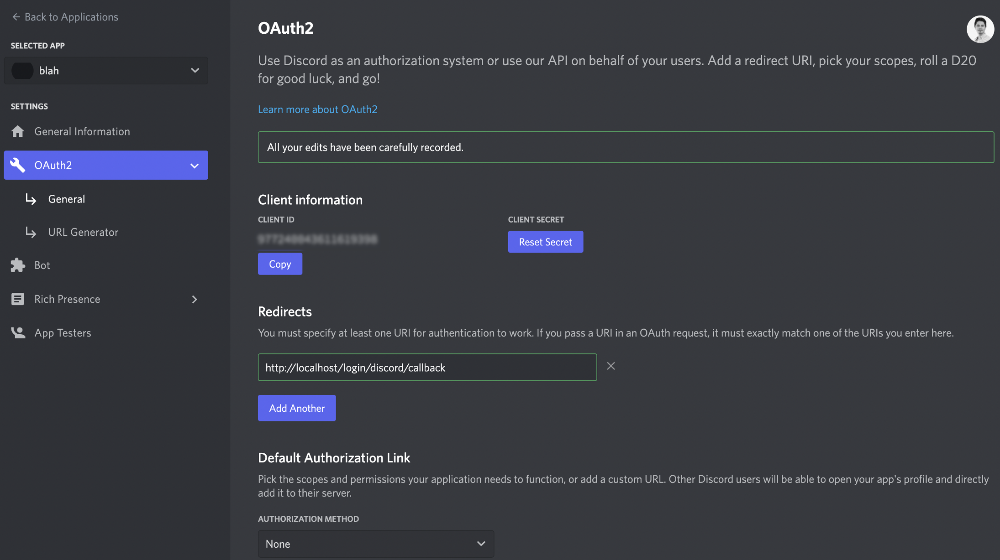
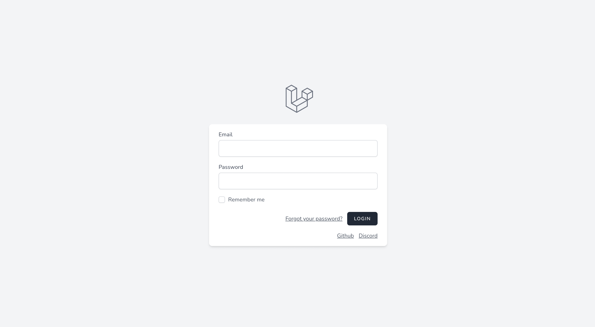
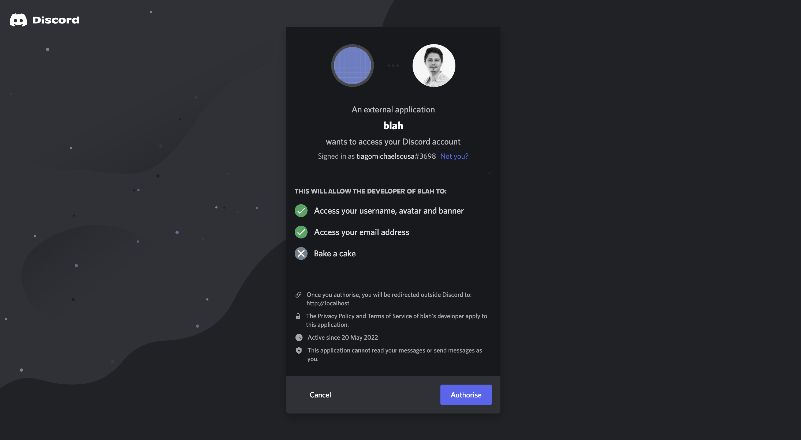

# Introduction

Nowadays, almost every single application allows OAuth integrations so users don't have to go through the boring and long registrations flows.
Besides simplifiying (by a lot 🥵) the registration flow, it also provides the developer that is implementing the authentication system with a lot of information, out of the box, regarding the user.

With this article we will learn how can we setup an authentication system with [Laravel](https://laravel.com/) and [NextJs](https://nextjs.org/) in minutes whilst adding the possibility to
login with [GitHub](https://github.com/) and [Discord](https://discord.com/)!

I called this application `Blah` and decided that this application will be the starting point for exploring more things within the Laravel ecosystem so that
I can create more content and share more things with you 👀

# Sail me!

If you have been following what I publish, you probably already saw the required steps on how to setup [Sail](https://laravel.com/docs/9.x/sail).
Sail is my go-to regarding developing with Laravel because it is really easy to setup and, as developer, I don't need to have the dependencies installed locally.
If you want a full overview regarding Sail you should [check this out](https://tiagomichaelsousa.dev/articles/laragraph-laravel-and-graphql-part-1/#Setting%20up%20Sail) 🚀

For this use case we will install Laravel and Sail directly with a magic `curl` request and name the application `blah-be` (which stands for blah backend, of course) and require `mysql` as a dependecy.

```bash
curl -s "https://laravel.build/blah-be?with=mysql" | bash
```

> I suggest to create a `blah` directory, `cd` into it and run the command so in the future the `blah-ui` stands at the same level

After creating our backend and having it ready with Sail we just need to run the command below in order to bring up our development environment.

```bash
sail up -d
```

After running this command you should be able to interact with your new backend application at [http://localhost](http://localhost).

# Oooof, some breeze ❄️

[Laravel Breeze](https://laravel.com/docs/9.x/starter-kits#laravel-breeze) allows you to setup an entire authentication system for Laravel with just a couple of commands and in no time.
It includes a lot of features like login, registration, password reset, email verification and password confirmation.

We will use Breeze ❄️ to easily setup this conventional authentication system and allow our users to login in Blah with `email` and `password`.

To require Breeze into our project run the following command in your terminal:

```bash
sail composer require laravel/breeze
```

And now, to install it, run the following command:

```bash
sail artisan breeze:install api
```

The `api` argument will tell Breeze to not publish the breeze ui assets in our resource path since this application will only contain the API logic.

At some point we need to allow users to login in the application, so let's create a couple of users with seeds before closing the backend part and jump to our NextJs application 😎

```diff filename=database/seeders/DatabaseSeeder.php
public function run()
{
-       // \App\Models\User::factory(10)->create();
+       \App\Models\User::factory(10)->create();
+       \App\Models\User::factory()->create([
+           'email' => 'email@mail.com',
+       ]);
}
```

Finally, run the migrations with the `--seed` flag and we are done with the backend for now 🔥

```bash
sail artisan migrate --seed
```

# Next, let me in!

Before setting up the OAuth functionality, let's create our [NextJs](https://nextjs.org) application and try to login one of the users we created with seeds,
in order to test if we are able to login with `email` and `password`.

The [Laravel Team](https://laravel.com/team) created a boilerplate for NextJs and Breeze so let's [KISS](https://en.wikipedia.org/wiki/KISS_principle) and not reinvent the wheel. Let's use [this](https://github.com/laravel/breeze-next)!

Under the `blah` folder (that I suggested creating) at the same level where `blah-be` is, run the following command:

```bash
git clone git@github.com:laravel/breeze-next.git blah-ui && cd blah-ui && rm -rf .git
```

This command will clone [this repository](https://github.com/laravel/breeze-next), rename it to `blah-ui` and remove the `.git` folder.

After doing that, let's create our `.env` file for the development environment with `NEXT_PUBLIC_BACKEND_URL` pointing to our `blah-be` url.

```bash
echo "NEXT_PUBLIC_BACKEND_URL=http://localhost" >> .env.development
```

Are we done? Almost! Just install the dependencies and run the application! 😎

```bash
yarn && yarn dev
```

After running the command, our frontend should be available at [http://localhost:3000](http://localhost:3000).
Let's try to use the `email@mail.com` account and the password (`password` 🤫) to login.

And guess what? We are in 🚀



# Some Socialite would be nice!

Now, that we have the backend and the frontend for `blah` we are ready to go! Let us start the juicy part, shall we?

Let's begin by requiring [Laravel Socialite](https://laravel.com/docs/9.x/socialite). Socialite is a package from the Laravel ecosystem that extracts the logic of interacting with
OAuth providers and facilitate, by a lot, our work!

To install Socialite run the following command inside the root folder of blah-be:

```bash
sail composer require laravel/socialite
```

Now, and since we will allow our users to login into Blah with multiple providers, let's setup what we need for OAuth which means create the `model`, the `migration`, the `controller` and the `factory`.

```bash
sail artisan make:model OAuthProvider -mcf --api
```

> The `--api` will apply Laravel conventions to our OAuthProviderController and create the `index`, `store`, `update` and `destroy` methods.

Let's start by updating our migration for the `o_auth_providers` table in our database like below:

```php showLineNumbers filename=database/migrations
public function up()
{
    Schema::create('o_auth_providers', function (Blueprint $table) {
        $table->id();
        $table->string('provider');
        $table->string('provider_id');
        $table->timestamps();

        $table->foreignId('user_id')
            ->constrained()
            ->onUpdate('cascade')
            ->onDelete('cascade');
    });
}

public function down()
{
    Schema::table('o_auth_providers', function (Blueprint $table) {
        $table->dropForeign(['user_id']);
    });

    Schema::dropIfExists('o_auth_providers');
}
```

Since some users prefer to login with OAuth, we can't make the `password` field required in our migration for the `users` table.
To solve this we just need to make the password field nullable by calling the `->nullable();` method in our migration and, of course, run the migrations again!

```diff filename=database/migrations
public function up()
{
    Schema::create('users', function (Blueprint $table) {
        $table->id();
        $table->string('name');
        $table->string('email')->unique();
        $table->timestamp('email_verified_at');
-          $table->string('password');
+          $table->string('password')->nullable();
        $table->rememberToken();
        $table->timestamps();
    });
}
```

```
sail artisan migrate:refresh --seed
```

A user can authenticate with multiple providers and we need to keep track of that. With that said, it's obvious that a user `hasMany` providers and a provider `belogsTo` a user!
Let's update our models and define our Eloquent relationships for both models and also update the `fillable` and `hidden` fields for the `OAuthProvider` model.

```php showLineNumbers filename=app/Models/User.php
public function providers(): HasMany
{
    return $this->hasMany(OAuthProvider::class);
}
```

```php showLineNumbers filename=app/Models/OAuthProvider.php
protected $fillable = [
    'provider',
    'provider_id',
    'user_id',
];

protected $hidden = [
    'created_at',
    'updated_at',
];

public function user(): BelongsTo
{
    return $this->belongsTo(User::class);
}
```

PHP 8.1 introduced `Enums` and Laravel quickly added features to enhance the development experience.
For now, let's create our `OAuthProviderEnum` and define the `GITHUB` case like below:

```php filename=app/Enums/OAuthProviderEnum.php
<?php

namespace App\Enums;

enum OAuthProviderEnum: string
{
    case GITHUB = 'github';
}
```

One of features that Laravel has around Enums, in order to enhance the development experience like referenced above, was the validation of the value passed to the endpoint through model binding.
To use this feature you just need to cast the wildcard defined in your route directly in your controller.
Let's see a real example to understand better!

In your `OAuthProviderController` add the following to the `index` method:

```php showLineNumbers filename=app/Http/Controllers/OAuthProviderController.php
public function index(OAuthProviderEnum $provider)
{
    return Socialite::driver($provider->value)->redirect();
}
```

In this `index` method we are saying that the `$provider` will be cast to `OAuthProviderEnum` and Laravel will ensure and validate that the value for this variable exists in the Enum.

To test this out, and since we will need the route for our functionality, let's update our `routes/auth.php` file and add these two routes:

```php showLineNumbers filename=routes/auth.php
Route::middleware(['guest'])
    ->prefix('login')
    ->name('login')
    ->group(function () {
        Route::get('{provider}', [OAuthProviderController::class, 'index'])->name('provider');
        Route::get('{provider}/callback', [OAuthProviderController::class, 'store'])->name('provider.callback');
    });
```

This piece of code will create the `/login/{provider}` and `/login/{provider}/callback` routes so that we can redirect the user to the OAuth provider and the OAuth provider redirects the user back to blah.

If you try to access [http://localhost/login/facebook](http://localhost/login/facebook) you will probably be faced with a `404` page which means that our model binding with the enum and respective validation
is working correctly! 🥳

> To ensure that you are using Model Binding correctly, the wildcard in your route should be written in the exact same way as the parameter of the function!

Before testing the full feature let's add the necessary code to create a user and register the provider that the user used when the OAuth provider redirects the user back to blah.

```php showLineNumbers filename=app/Http/Controllers/OAuthProviderController.php
public function store(OAuthProviderEnum $provider)
{
    $socialite = Socialite::driver($provider->value)->user();

    $user = User::firstOrCreate([
        'email' => $socialite->getEmail(),
    ], [
        'name' => $socialite->getName()
    ]);

    $user->providers()->updateOrCreate([
        'provider' => $provider,
        'provider_id' => $socialite->getId(),
    ]);

    Auth::login($user);

    return redirect(env('FRONTEND_URL'));
}
```

From the code prespective, there are only two steps missing in the backend which are:

- update our service providers and add github
- update our environment variables

Let's start with the providers and update our `config/services.php` file.

```php showLineNumbers filename=config/services.php
'github' => [
    'client_id' => env('GITHUB_CLIENT_ID'),
    'client_secret' => env('GITHUB_CLIENT_SECRET'),
    'redirect' => env('GITHUB_REDIRECT_URI'),
],
```

Well, it looks like we will need to define `GITHUB_CLIENT_ID`, `GITHUB_CLIENT_SECRET` and `GITHUB_REDIRECT_URI` in our `.env` file ...

```bash filename=.env
GITHUB_CLIENT_ID=
GITHUB_CLIENT_SECRET=
GITHUB_REDIRECT_URI=
```

But? 🧐 Where can I get these values? Normally, each OAuth provider has a developer page where you can create applications.
Taking as an example GitHub, you can access it [here](https://github.com/settings/developers).
We just need to fill in the form correctly!



> The `Authorization callback URL` is very important as it's the URL where the provider will redirect the user back once they login.

After filling the form correctly and clicking `Register Application` you just need to get your `client_id`, generate the `client_secret` and put them in our `.env` correctly for both `GITHUB_CLIENT_ID` and `GITHUB_CLIENT_SECRET`.
Regarding `GITHUB_REDIRECT_URI` it should be the same as you define in the route and that you filled in the form, which is `http://localhost/login/github/callback`.

# Git things done!

Now that the backend OAuth integration is done let's update our NextJs app and add a button to login with GitHub!

For that, update your `login.js` file for `blah-ui` and add the following below the typical login button

```jsx showLineNumbers filename=src/pages/login.js
<div className="flex items-center justify-end mt-4 gap-3">
  <Link href={`${process.env.NEXT_PUBLIC_BACKEND_URL}/login/github`}>
    <a className="underline text-sm text-gray-600 hover:text-gray-900">Github</a>
  </Link>
</div>
```

Let's try to click it?



If you did everything correctly, the page above should be presented to you and after putting your credentials you should be redirected and logged in into blah!

# Gimme more!

Laravel Socialite allows you to login out of the box with providers like Facebook, Twitter, LinkedIn, Google, GitHub, GitLab, and Bitbucket
but what about other providers?

[Socialite Providers](https://socialiteproviders.com/) provides a huge collection of OAuth integrations.
Setting them up is really easy to prove it to you, let's implement login with [Discord](https://discord.com/)!

```bash
sail composer require socialiteproviders/discord
```

After installing the package we need to update our `EventServiceProvider` and add the respective listener:

```diff filename=app/Providers/EventServiceProvider.php
protected $listen = [
    Registered::class => [
        SendEmailVerificationNotification::class,
    ],
+      \SocialiteProviders\Manager\SocialiteWasCalled::class => [
+          \SocialiteProviders\Discord\DiscordExtendSocialite::class . '@handle',
+      ],
];
```

Now, we need to create the application in the OAuth provider, which in this case is [Discord](https://discord.com/).
For that, go to the [developer page](https://discord.com/developers/applications) and create a new application called blah as we did for GitHub!

After the application is created, reset your `client_secret` and save it alongside the `client_id`. Also, the redirects must be
defined to our callback route with correct path, which theorically should be `http://localhost/login/discord/callback`.

The imagem below shows the configuration as you need and as it should be.



After this step we need to do some changes in both `blah-be` and `blah-ui` applications.
Starting with `blah-be`, we need to add Discord to our `OAuthProviderEnum` in order to be validated and approved as a valid provider.

```diff filename=app/Enums/OAuthProviderEnum.php
namespace App\Enums;

enum OAuthProviderEnum: string
{
    case GITHUB = 'github';
+      case DISCORD = 'discord';
}
```

The config for the services also needs to be updated and discord needs to be added as a new service like so:

```php showLineNumbers filename=config/services.php
'discord' => [
  'client_id' => env('DISCORD_CLIENT_ID'),
  'client_secret' => env('DISCORD_CLIENT_SECRET'),
  'redirect' => env('DISCORD_REDIRECT_URI'),
],
```

Finally, and to wrap up our backend implementation, we need to add the secrets to our `.env` file 🔥

```bash filename=.env
DISCORD_CLIENT_ID=
DISCORD_CLIENT_SECRET=
DISCORD_REDIRECT_URI=
```

Regarding `blah-ui` we just need to add a new button in our login page (as we already did previously for GitHub) for our new provider

```jsx showLineNumbers line=8-12 filename=src/pages/login.js
<div className="flex items-center justify-end mt-4 gap-3">
  <Link href={`${process.env.NEXT_PUBLIC_BACKEND_URL}/login/github`}>
    <a className="underline text-sm text-gray-600 hover:text-gray-900">Github</a>
  </Link>

  <Link href={`${process.env.NEXT_PUBLIC_BACKEND_URL}/login/discord`}>
    <a className="underline text-sm text-gray-600 hover:text-gray-900">Discord</a>
  </Link>
</div>
```

After this, your login screen should be something similar to the following image



If you click either GitHub's or Discord's links you should be redirected to the provider login page. Taking Discord as an example now, you should see something like this



And after authorizing the access to blah you should be redirected and logged in! 🥹

# Conclusions

If you took the time to read this article, I hope that it helped you somehow!

As always, you can find the implementation for the entire article in this [Pull Request](https://github.com/tiagomichaelsousa/blah/pull/1)!

If you found this article interesting, feel free to share it with your colleagues and friends, because you know... Sharing
is caring!

Also, if you enjoy working at a large scale in projects with global impact and if you enjoy a challenge, please reach
out to us at [xgeeks](https://xgeeks.io/)! We're always looking for talented people to join our team 🙌
