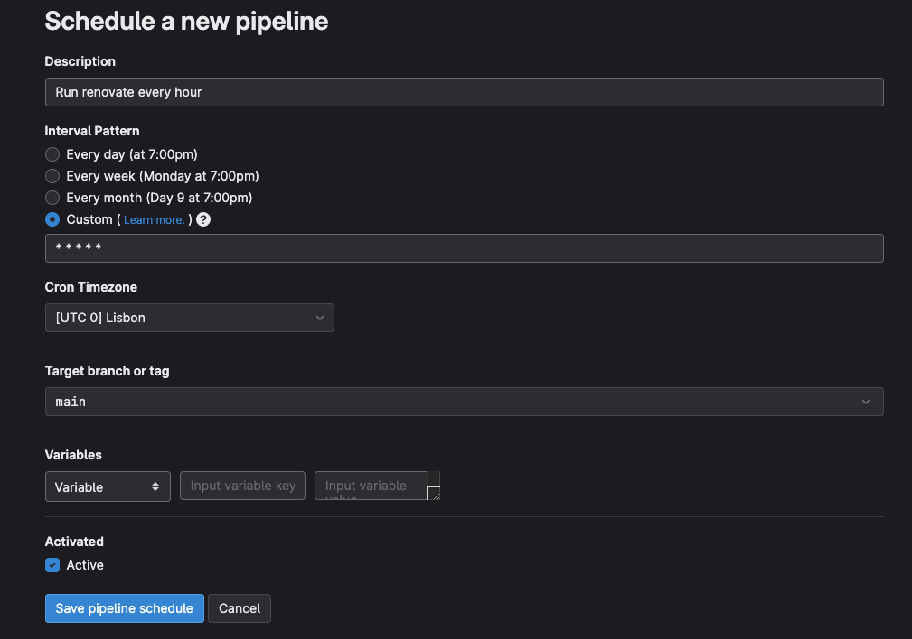
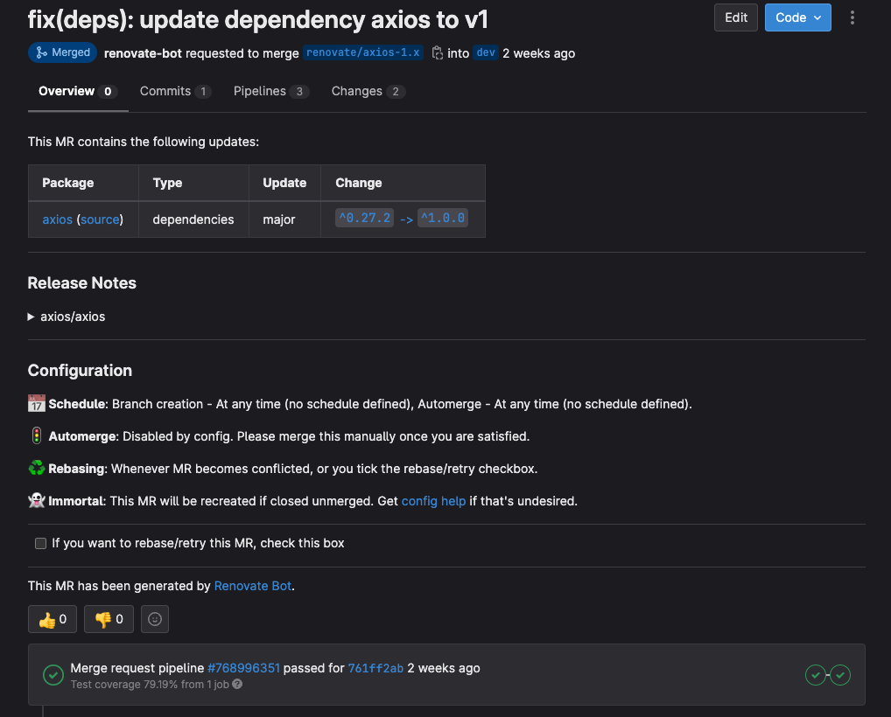
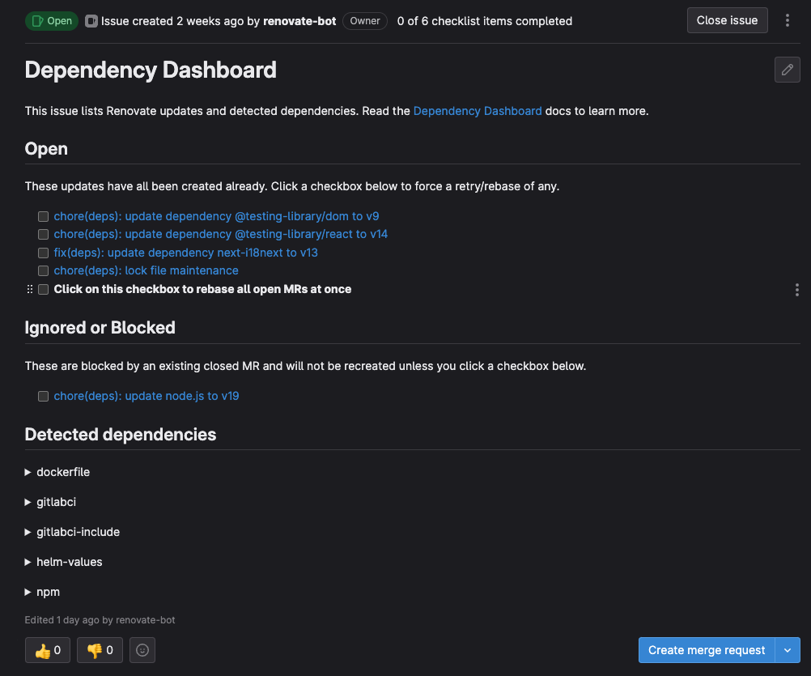
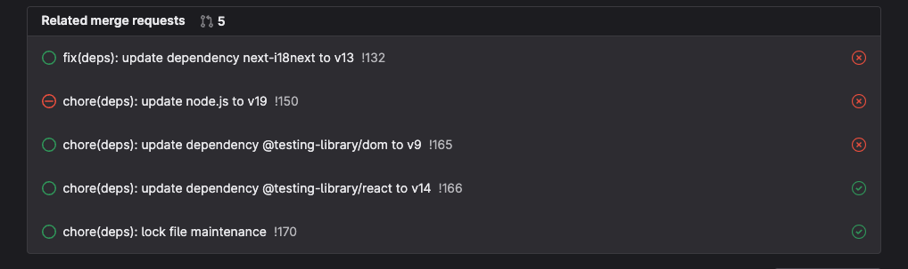

# Introduction
Maintaining applications up-to-date is crucial for several reasons.
It **ensures the security of the application** and the data it handles, **enhances performance**,
ensures compatibility with other software, and ensures compliance with regulations.

Maintaining up-to-date applications that are free from vulnerabilities can be challenging.
This is due to the need to determine the latest versions, identify any breaking changes,
and ensure seamless integration with your application. While it is possible to do this manually,
it is not a scalable solution, as the difficulty increases exponentially as your organization grows.


# Renovate


In order to address the scalability issue, we automated this process using [Renovate](https://github.com/renovatebot/renovate).
Although it can be used on both GitHub and GitLab, this article will focus on the GitLab integration.

Renovate is a versatile tool for updating dependencies that can be seamlessly integrated into your workflows.
For instance, if you have a React application, Renovate can update both `package.json` and `package-lock.json` or `yarn.lock` files,
and ensure that both direct and peer dependencies are maintained. In addition, it can update your CI/CD, `Dockerfile`, and `docker-compose.yaml` files to keep them up-to-date.
For the GitHub Actions integration, Renovate can even update the actions used on your workflows.

# GitLab integration ⚙️

In order to integrate Renovate into our projects, we need to make changes to our CI/CD pipelines.
If you are not familiar with GitLab CI, we recommend referring to their [documentation](https://docs.gitlab.com/ee/ci/).
The first step is to create a specific stage called renovate:


```yaml line=5
stages:
  - install
  - build_test_lint
  - deploy
  - renovate
```

With Renovate now having its own stage to run, it is time to configure the job.

As you may observe, there are many environment variables available to configure the execution of Renovate.
However, some of these variables are mandatory and must be defined.
You can check what environment variables are available on [Self-Hosted configuration options](https://docs.renovatebot.com/self-hosted-configuration/)


```yaml
renovate:
  stage: renovate
  image: renovate/renovate:34.121.2-slim
  resource_group: production
  variables:
    RENOVATE_BASE_DIR: $CI_PROJECT_DIR/renovate
    RENOVATE_ENDPOINT: $CI_API_V4_URL
    RENOVATE_PLATFORM: gitlab
    RENOVATE_EXTRA_FLAGS: --autodiscover=true --autodiscover-filter=foo/bar/*
    RENOVATE_REQUIRE_CONFIG: 'required'
    RENOVATE_OPTIMIZE_FOR_DISABLED: 'true'
    RENOVATE_REPOSITORY_CACHE: 'enabled'
    RENOVATE_ONBOARDING: 'false'
    RENOVATE_IGNORE_PR_AUTHOR: 'true'
    RENOVATE_LOG_FILE: renovate-log.ndjson
    LOG_LEVEL: info
  cache:
    key: ${CI_COMMIT_REF_SLUG}-renovate
    paths:
      - renovate/cache/renovate/repository/
  only:
    - schedules
  script:
    - renovate $RENOVATE_EXTRA_FLAGS
  artifacts:
    when: always
    expire_in: 1d
    paths:
      - '$RENOVATE_LOG_FILE'
```

To successfully configure renovate there are two environment variables that must be defined, namely:
- **RENOVATE_TOKEN:** A Personal Access Token (PAT) with `read_user`, `api`, `write_repository` permissions.
- **GITHUB_COM_TOKEN:** A PAT from GitHub with minimum permissions. This token it's not mandatory and can be created on your personal account because
it's only used to get dependencies' changelog from GitHub API and bypass the requests limit.

Other than these two required environment variables, you can also configure the following:

- **RENOVATE_PLATFORM:**
Due to our integration being on GitLab we must define this value as `gitlab` to Renovate successfully run.
- **RENOVATE_EXTRA_FLAGS:**
    - `--autodiscover` When enabled, Renovate runs on every repository that the bot account can access.
    - `--autodiscover-filter` To limit which repositories Renovate can access, you define a glob-style or regex pattern path.
- **RENOVATE_REQUIRE_CONFIG:**
With the `autodiscover` and `autodiscover-filter` flags defined, we set this variable to require the config file in each repository.


If you don't have context in regards to how create environment variables in GitLab you can have a 👀 into the [documentation](https://docs.gitlab.com/ee/ci/variables/#for-a-project).

# Renovate configuration 🤖
Let's use our example of an application in React, now we need to create a `renovate.json` file to configure how Renovate runs in our repository.

```json
{
  "$schema": "https://docs.renovatebot.com/renovate-schema.json",
  "extends": [
    "config:base"
  ],
  "rangeStrategy": "update-lockfile",
  "prHourlyLimit": 10,
  "labels": ["dependencies"],
  "patch": {
    "enabled": false
  },
  "packageRules": [
    {
      "matchUpdateTypes": ["minor"],
      "automerge": true
    }
  ],
  "lockFileMaintenance": {
    "enabled": true
  }
}
```

The configuration shown above helps reduce the number of merge requests (MRs) opened by the Renovate bot by ignoring patches,
which in turn reduces the number of pipelines executed to build, test, and lint our application. 
Another property that you may have noticed is `lockFileMaintenance`, which, when enabled, prompts Renovate to create an MR that updates all `peerDependencies`, 
thus preventing your application from becoming outdated and vulnerable to security threats.


# How to run renovate? 🤔
In order to run our Renovate bot, we have created a schedule on GitLab that runs hourly.
To create this schedule, go to CI/CD -> Schedules and click "New schedule".
You will then be prompted to fill out a form with the necessary configurations.



After filling out and saving all configurations, you will see a list of your schedules that includes the newly created one.
In this new schedule you can see three buttons and one is to force its execution.

##### CI/CD additional configuration
Before starting the renovate's execution, you will need to check your CI/CD jobs and add an additional rule to not run when a schedule is triggered.
If you don't add this rule, it will trigger all jobs, for example, tests, linting, build, deploy, security checks, etc. If you have self-hosted runners it can be
a "pain in the ass" when you see multiple pipelines being triggered at the same time!

To add that rule, you will need to add the following line:

```diff
install:
  stage: install
+    except:
+      - schedules
  script:
    - yarn install --frozen-lockfile --no-progress --non-interactive

build:
  stage: build_test_lint
+    except:
+      - schedules
  script:
    - yarn build
  allow_failure: false

test:coverage:
  stage: build_test_lint
+    except:
+      - schedules
  script:
    - yarn test --coverage
  coverage: '/^Lines\s*:\s*([^%]+)/'
  allow_failure: false

lint:
  stage: build_test_lint
+    except:
+      - schedules
  script:
    - yarn lint
  allow_failure: false
```

##### Renovate output
Once your Renovate bot is running, you can monitor its execution on the Pipelines page. 
As shown in the output below, Renovate creates new merge requests and updates branches if they need to be rebased with the target branch.
Renovate also detects which package managers your repository uses and checks them accordingly, for example, `Dockerfile`, `npm`, and even GitLab CI.

```bash
 INFO: Repository started (repository=foo/bar/react-app)
       "renovateVersion": "34.121.2"
 INFO: Dependency extraction complete (repository=foo/bar/react-app, baseBranch=dev)
       "stats": {
         "managers": {
           "dockerfile": {"fileCount": 1, "depCount": 2},
           "gitlabci": {"fileCount": 1, "depCount": 1},
           "gitlabci-include": {"fileCount": 1, "depCount": 1},
           "npm": {"fileCount": 1, "depCount": 53}
         },
         "total": {"fileCount": 4, "depCount": 57}
       }
 INFO: Branch updated (repository=foo/bar/react-app, branch=renovate/react-dom-18.x)
       "commitSha": "5f4b7f24d8f1079a8c32ad489b77da5301d3ecbb"
 INFO: PR created (repository=foo/bar/react-app, branch=renovate/axios-1.x)
       "pr": 131,
       "prTitle": "fix(deps): update dependency axios to v1"
 INFO: Branch updated (repository=foo/bar/react-app, branch=renovate/typescript-4.x)
       "commitSha": "c717d37d306c4b0e2d042abbce3a9a419a55f776"
 INFO: Branch updated (repository=foo/bar/react-app, branch=renovate/nextjs-monorepo)
       "commitSha": "40fb06d94a66fcb702ba12e68428a7a06000f51d"
 INFO: Branch updated (repository=foo/bar/react-app, branch=renovate/major-react-monorepo)
       "commitSha": "c59570d2aa8a80aeb6382733159fd3c5b6bc16e2"
 INFO: Branch updated (repository=foo/bar/react-app, branch=renovate/major-jest-monorepo)
       "commitSha": "867426b40b47cdaa7d09e8e38e4735b3c3bc9ba0"
 INFO: Branch updated (repository=foo/bar/react-app, branch=renovate/major-nextjs-monorepo)
       "commitSha": "ed04af14bb3a660a3f0f3509a5905d9c341e974f"
 INFO: Repository finished (repository=foo/bar/react-app)
       "cloned": true,
       "durationMs": 210683
```

If the bot skips one of your applications but detects it, and something does not go as planned, you can check the job artifact file that has been generated.
The log file that is generated by default has the debug log level, which provides more detailed logs for troubleshooting.

##### Merge request
When the renovate execution succeeds, multiple MRs are created, one for each dependency to be updated. As we configured the bot to tag all MRs with the label
`dependencies` it's easy to filter by that. The merge request has some information about the type of update (major, minor, patch), the release notes fetch from GitHub using the token that
you have set, and also has a section describing the configurations for this MR.



##### Renovate dashboard
Renovate offers a dashboard feature that creates an issue at the first run of the bot.
This issue describes all the dependencies that need to be updated and groups them into "Awaiting schedule", "Open", and "Ignored or Blocked" categories.
You can access this dashboard on your application's issues list.



Also, this dashboard tags all merge requests created by the Renovate and you can see them in the "Related merge requests" section.



# Conclusions

We shared this with you because it helped us somehow and if it helped us it can help you and/or your team!

We hope you found this article interesting, feel free to share it with your colleagues or friends, because you know... Sharing
is caring!

Also, if you enjoy working at a large scale in projects with global impact and if you enjoy a challenge, please reach
out to us at [xgeeks](https://xgeeks.io/)! We're always looking for talented people to join our team 🙌


Check out our social media channels if you want to get a sneak peek of life at xgeeks! See you soon!
