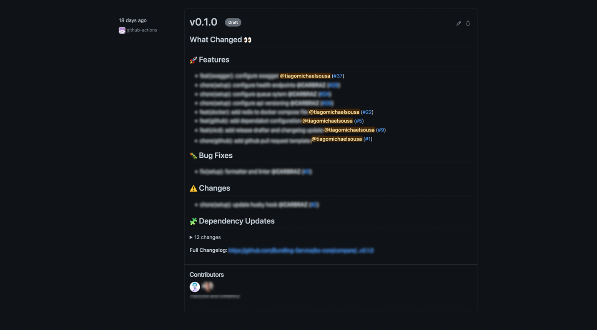

# Introduction
Let's start with a reality check here, everyone uses third-party packages to speed up your development process 
and you know what most of these packages have in common? They all have a `CHANGELOG.md` file in the root folder.
Having this file in your repository doesn't mean that you keep it up-to-date (and I don't blame you) because we often
prioritize the development over the documentation, **unfortunately**.

But why is this file so important and why should I care? The `CHANGELOG.md` normally contains the significate changes 
that were made over time, grouped by version/release.

It's way easier for me to read the changelog file and understand what changed between versions than going through every 
single release and read the description, **if present**.

Based on these facts we can easily find a couple of problems that need to be fixed, namely:
- Different formats for every single `CHANGELOG.md` file;
- Empty and/or nonexistent `CHANGELOG.md` files;
- Empty release/versions descriptions.

# Keep a Changelog

[keepachangelog](https://keepachangelog.com/en/1.0.0/) is a piece of documentation created and maintained by [Olivier Lacan](https://olivierlacan.com/) 
that explains [what](https://keepachangelog.com/en/1.1.0/#what) is a changelog, 
[why](https://keepachangelog.com/en/1.1.0/#why) you should keep a changelog and 
[who](https://keepachangelog.com/en/1.1.0/#who) needs a changelog. 

Besides that, it also gives you a couple of guiding principles regarding how you should structure your `CHANGELOG.md` file. 
If you never heard about this topic, reading the content from this website is a good way to start learning about changelogs. 
What you will learn from this website paired with [Conventional Commits](https://www.conventionalcommits.org/en/v1.0.0/) 
will allow you to have a clean and structured `CHANGELOG.md` file without any effort from your side while also giving you consistency.

# Start drafting your releases
But how can I automate the process of drafting a release? Well, in fact, is way easier than you think! 
Have you ever heard about [Release Drafter](https://github.com/release-drafter/release-drafter) GitHub Action?
This action is very simple to setup and highly configurable as you can see in the documentation but I will do the process with you 😎

First of all, you need to run the action in a workflow so let's start by creating a new one!
```yaml filename=.github/workflows/release-drafter.yaml
name: Release Drafter

on:
  push:
    branches:
      - main

jobs:
  update_release_draft:
    name: Release drafter
    runs-on: ubuntu-latest

    steps:
      - name: Update Release Draft
        uses: release-drafter/release-drafter@v5
        env:
          GITHUB_TOKEN: ${{ secrets.GITHUB_TOKEN }}
```
This configuration doesn't work for GitHub Enterprise but it can be easily fixed by adding a step before calling the release drafter action 
as specified in the [documentation](https://github.com/release-drafter/release-drafter#usage).

```diff filename=.github/workflows/release-drafter.yaml
+  - name: Setup GitHub Enterprise
+    run: |
+     echo "GHE_HOST=${GITHUB_SERVER_URL##https:\/\/}" >> $GITHUB_ENV
```


From my understanding, the team responsible for developing this action quickly understood that this file could get very extensive based on all the configurations
that they wanted to make available. For that reason, the action configuration is split from the release drafter configuration so you need to create another file.
The default path defined in the action for this configuration file is `.github/release-drafter.yml` but if you want you can change it.
For the purpose of this article we will use the default value so let's create a new file with the configuration that we need.

```yaml filename=.github/release-drafter.yml
# This release drafter follows the conventions
# from https://keepachangelog.com

name-template: 'v$RESOLVED_VERSION'
tag-template: 'v$RESOLVED_VERSION'
template: |
  ## What Changed 👀
  
  $CHANGES
  **Full Changelog**: https://github.com/$OWNER/$REPOSITORY/compare/$PREVIOUS_TAG...v$RESOLVED_VERSION
categories:
  - title: 🚀 Features
    labels:
      - feature
      - enhancement
  - title: 🐛 Bug Fixes
    labels:
      - fix
      - bug
  - title: ⚠️ Changes
    labels:
      - changed
  - title: ⛔️ Deprecated
    labels:
      - deprecated
  - title: 🗑 Removed
    labels:
      - removed
  - title: 🔐 Security
    labels:
      - security
  - title: 📄 Documentation
    labels:
      - docs
      - documentation      
  - title: 🧩 Dependency Updates
    labels:
      - deps
      - dependencies
    collapse-after: 5

change-template: '- $TITLE @$AUTHOR (#$NUMBER)'
change-title-escapes: '\<*_&' # You can add # and @ to disable mentions, and add ` to disable code blocks.
version-resolver:
  major:
    labels:
      - major
  minor:
    labels:
      - minor
  patch:
    labels:
      - patch
  default: patch
  
exclude-labels:
  - skip-changelog
```

From now on, with these two files configured, every time that you push to the main branch the release drafter action will be called and the draft will be updated
based on the PR configurations. By PR configurations I mean the labels and the commit title!
Since the labels and commit title (based on conventional commits) should follow conventions we should also validate this! 👀

But before going too deep into validation and other workflows let's just have a look at how the draft will look like




# Always validate your requirements 

As you saw above, **the title** of the PR and **the labels** will be crucial to draft the release correctly so we must validate them!
Let's start with the title validation and for that we will create a new workflow
> You don't need to create a workflow for every single [job](https://docs.github.com/en/actions/using-workflows/workflow-syntax-for-github-actions#jobs) 
and/or [step](https://docs.github.com/en/actions/using-workflows/workflow-syntax-for-github-actions#jobsjob_idsteps). You should create and develop your workflows how it suits you the best! 😎

```yaml filename=.github/workflows/pr-title-checker.yaml
name: Check PR title

on:
  pull_request:
    types:
      - opened
      - reopened
      - edited
      - synchronize

concurrency:
  group: ${{ github.workflow }}-${{ github.event.pull_request.number }}
  cancel-in-progress: true

jobs:
  title-checker:
    name: Check PR title
    runs-on: [ self-hosted ]
    
    steps:
      - uses: aslafy-z/conventional-pr-title-action@v2
        env:
          GITHUB_TOKEN: ${{ secrets.GITHUB_TOKEN }}
```

With this workflow configured, every time that the Pull Request is `opened`, `reopened`, `edited` or `synchronize` 
the title will be validated based on conventional commits as we previously discussed!

Now that we have the title validated, let's validate the Pull Request Labels.
For that, create a new workflow called `.github/workflows/label-checker.yaml` and add the following.

```yaml filename=.github/workflows/label-checker.yaml
name: Label Checker

on:
  pull_request:
    types:
      - opened
      - synchronize
      - reopened
      - labeled
      - unlabeled

concurrency:
  group: ${{ github.workflow }}-${{ github.event.pull_request.number }}
  cancel-in-progress: true
  
jobs:
  check_semver_labels:
    name: Check Semver labels
    runs-on: [ self-hosted ]

    steps:
      - name: Check for Semver labels
        uses: danielchabr/pr-labels-checker@v3.1
        with:
          hasSome: major,minor,patch
          githubToken: ${{ secrets.GITHUB_TOKEN }}

  check_cc_labels:
    name: Check conventional commits labels
    runs-on: [ self-hosted ]
    steps:
      - uses: danielchabr/pr-labels-checker@v3.1
        with:
          hasSome: feature,fix,changed,deprecated,removed,security,docs,dependencies
          githubToken: ${{ secrets.GITHUB_TOKEN }}
```

This will ensure that the Pull Request has either a `major`, `minor` or `patch` label and that a 
`feature`, `fix`, `changed`, `deprecated`, `removed`, `security`, `docs`, `dependencies` is defined.

> When you create a new GitHub repository some of these labels are already defined but others aren't. 
Feel free to [review and manage](https://docs.github.com/en/issues/using-labels-and-milestones-to-track-work/managing-labels) the labels that you have configured!

Do you use dependabot to keep your dependencies up to date? Don't worry! this action and this configuration will work as a charm for you!

# CHANGELOG.me 
At this point let's make a quick recap regarding what we already have configured and running:
- Release Drafter workflow and configuration
- Pull Request labels validation
- Pull Request title validation based on conventional commits

Are we ready? Is this done? 🤔 Unfortunately something is missing! 
The release draft is done but the `CHANGELOG.md` file never gets updated because we never released anything!

For the sake of this article, I will create another workflow but of course that this should be part of your deployment workflow to the production environmnent.

```yaml filename=.github/workflows/update-changelog.yml
name: Update Changelog

on:
  release:
    types: 
      - released

jobs:
  update:
    name: Update Changelog
    runs-on: ubuntu-latest

    steps:
      - name: Checkout code
        uses: actions/checkout@v2

      - name: Update Changelog
        uses: stefanzweifel/changelog-updater-action@v1
        with:
          latest-version: ${{ github.event.release.name }}
          release-notes: ${{ github.event.release.body }}

      - name: Commit updated Changelog
        uses: stefanzweifel/git-auto-commit-action@v4
        with:
          branch: main
          commit_message: 'docs(changelog): update changelog'
          file_pattern: CHANGELOG.md
```

Now, every time that a release is published the `CHANGELOG.md` file will be updated!

> If you don't have a `CHANGELOG.md` in your repository please create one!

# Conclusions

In the IT world, there are a lot of ways to solve the same problem and every solution must be considered a viable solution.
The decision comes afterward and should always be based on **PROS** and **CONS**.
With that said, you need to always keep in mind that **Nothing is set in stone** and you should and must always challenge implementations and points of view
like the one that I just showed you.
This approach is working pretty well for my personal projects and was even suggested and implemented in some of the client projects that I work on.
The feedback based on experience that I have with this approach is that is much easier to see what changed, compare versions and automate processes while keeping track 
of everything!

I shared this with you because it helped me somehow and if it helped me it can help you and/or your team!

I hope you found this article interesting, feel free to share it with your colleagues or friends, because you know... Sharing
is caring!

Also, if you enjoy working at a large scale on projects with global impact and if you enjoy a challenge, please reach
out to us at [xgeeks](https://xgeeks.io/)! We're always looking for talented people to join our team 🙌
